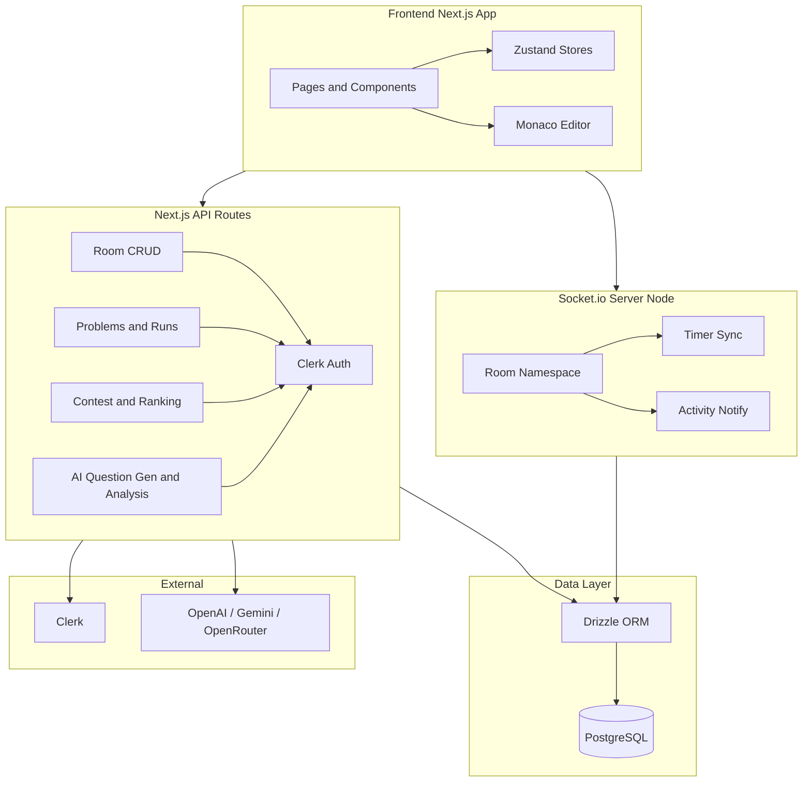

# Realtime Coding Arena + AI Interview Platform — Implementation Plan

---

## 1. Project Overview

**Product:** A hackathon-ready, demo-impressive coding platform combining:

- **Realtime Coding Race Rooms** (max 4 users, shared problem, independent code, no code visibility)
- **AI Interview Mode** (LLM-driven interviews)
- **AI Code Analysis** (feedback on submissions)
- **Analytics Dashboard** (Recharts)
- **AI Question Generation** (level, company type, topic, source style)
- **Contest Mode** (Codeforces-style timer, ranking, auto-submit)

**Principles:** Clean architecture, modular design, demo-ready features, no overengineering, buildable in hackathon scope.

**Tech Stack (fixed):**

- **Frontend:** Next.js 16 (App Router), TypeScript, Tailwind CSS, shadcn/ui, Zustand, Monaco Editor (@monaco-editor/react), Sonner, Recharts
- **Backend:** Next.js API Routes + separate Node.js socket.io server
- **Database:** PostgreSQL, Drizzle ORM
- **Auth:** Clerk
- **Realtime:** socket.io
- **AI:** OpenAI / Gemini / OpenRouter (LLM-compatible)

---

## 2. Architecture Diagram

**Data flow (high level):**

- **Room lifecycle:** Create/join via API + DB; start race and all realtime events (timer, run, submit, solved) via socket.io; no code ever sent over socket.
- **Execution:** Run/Submit from UI → API → (mock sandbox or real judge) → result stored; socket used only to broadcast "user X ran/submitted/solved" for Sonner.
- **Timer:** Server is source of truth; `timer_sync` event pushes remaining seconds to all clients; clients count down locally and re-sync on join or periodically.

---

## 3. Folder Structure

See implementation. Key paths: `app/(dashboard)/`, `app/api/`, `components/race/`, `components/contest/`, `components/editor/`, `lib/db/`, `lib/socket/`, `lib/ai/`, `stores/`, `server/`, `drizzle/`.

---

## 4. Drizzle Database Schema (with relations)

**File:** `lib/db/schema.ts`

**Tables:** users, problems, rooms, room_participants, test_cases, contests, contest_problems, contest_participants, submissions, contest_scores, ai_generated_questions. Relations as defined in schema.

---

## 5. Realtime Coding Room Plan (with socket flow)

**Socket server:** Single namespace `/race`. Events: create_room, join_room, start_race, timer_sync, run_code, submit_code, user_solved, race_end, room_full. Code never sent over socket.

---

## 6. Sonner Notification Flow

Top-center Toaster. Trigger on user_ran_code, user_submitted, user_solved. Messages: "X ran the code", "X submitted solution", "X solved the problem!"

---

## 7. Timer Synchronization Logic

Server source of truth (ends_at). timer_sync payload: remainingSeconds, endsAt. Client countdown; re-sync on join.

---

## 8. Zustand Store Modeling

race-store, contest-store, interview-store, analytics-store — as specified in plan.

---

## 9. AI Question Generation Prompt Templates

**File:** `lib/ai/prompts/question-gen.ts` — buildQuestionGenPrompt(params). Params: level, companyType, topic, sourceStyle.

---

## 10. API Routes Plan

All routes implemented: rooms, problems, run, submit, contests, ai/generate-question, ai/analyze-code, interview, analytics/me.

---

## 11. Security Considerations

Auth on all routes; room creator only starts race; no code over socket; rate limit run/submit and AI; parameterized queries; CORS.

---

## 12. Hackathon Execution Strategy

Phase 1–5 as per plan. This document is the single source of truth for architecture, schema, socket events, and execution order.
